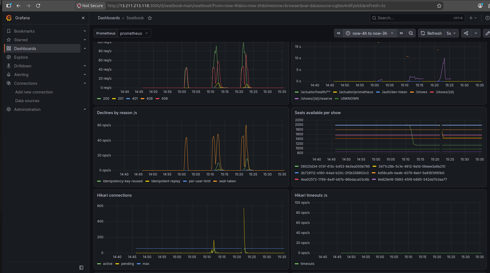
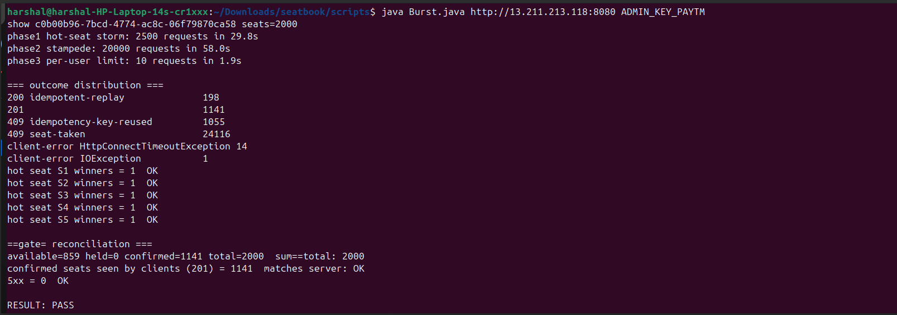

# WRITEUP

**Seatbook:** seat-reservation service using Spring Boot 3.4 / Java 21 (virtual threads), JPA/Hibernate, Azure SQL, Docker on EC2, and Prometheus + Grafana.

## 1. Atomic reservation

The database makes the booking decision atomically:

```sql
UPDATE seats SET status='confirmed', reservation_id=?, user_id=?
WHERE show_id=? AND status='available' AND seat_label IN (?, ...)
```

The transaction compares the affected-row count with the requested seat count. A mismatch rolls back and returns `409 seat-taken`. There is no check-then-act gap: concurrent requests queue on the seat row, and only the first can change `available` to `confirmed`.

Multi-seat reservations are **all-or-nothing**. Seats are deduplicated and sorted to provide a consistent lock order: reservation → seats → user quota. Cancellation follows the same order.

Deadlock victims (SQL Server 1205), lock timeouts, and Azure transient/throttling errors are retried up to 5 times with exponential backoff, with each retry running as a fresh transaction.

The per-user limit uses a guarded `MERGE` on `user_show_quota`, incrementing only when `active_seats + n <= limit`. It runs in the same transaction as the seat claim, so rollback restores both. Concurrent requests for one user serialize on that quota row.

A local Caffeine table provides short-lived seat admission control: `IN_FLIGHT` during reservation and `CONFIRMED` for 5 seconds. Acquisition is non-blocking and ordered, so it cannot deadlock. It can reject hot-seat losers without consuming a DB connection, but it is **never the source of truth**; the database remains authoritative.

## 2. Idempotency

`reservations` has `UNIQUE (user_id, idempotency_key)` and stores a SHA-256 `request_hash` of the show and sorted seats.

- A concurrent duplicate blocks on the unique index until the first transaction commits or rolls back.
- Same key + same body → original reservation with `200` and `Idempotent-Replayed: true`.
- Same key + different body → `409 idempotency-key-reused`.
- Only the first successful request returns `201`.

Retries with the same key bypass the local seat lock and rely on the database unique constraint for replay.

Declined attempts are rolled back and not stored, so their keys can later succeed. Keys are scoped per user, not per show; reusing one for another request with different content produces a body-mismatch response.

## 3. Holds & cancellation

I chose an explicit-cancel model with no auto-expiring holds. Successful reservations go directly to `confirmed`, so `held` remains zero while the invariant

**available + held + confirmed = total**

still holds.

Cancellation:

1. Marks the reservation cancelled only when `id`, `user_id`, and `status='confirmed'` match.
2. Releases its confirmed seats.
3. Decrements the user's quota.

A released seat cannot accidentally overwrite a newer reservation because the release also matches the old `reservation_id`. Non-owners receive `403`; repeated cancellation is a no-op.

## 4. Consistency vs availability

The service chooses **consistency** during a database partition. Booking always requires Azure SQL; memory can refuse requests but can never grant seats.

Readiness checks Azure SQL through a dedicated one-connection pool with a 2s timeout, so it is not queued behind application load. Liveness does not touch the database, preventing DB failures from unnecessarily restarting the container.

Currently DB failures can surface as `500` after Hikari's connection wait (60s). This is a known weakness; the next improvement is a fast `503` with `Retry-After`.

All authoritative state remains in the database. The in-memory gauge reconciles against it every 5 seconds after recovery.

## 5. Observability

Prometheus scrapes `/actuator/prometheus` every 5 seconds. Structured JSON logs include `X-Request-Id`, allowing a failing request to be traced end-to-end.

| Alert | Meaning |
|---|---|
| 5xx > 0 for 2+ min | Violates the zero-5xx requirement; logs expose the SQL cause |
| Hikari pending/timeouts increasing | DB connection pool is saturated |
| Readiness failing/flapping | DB or firewall connectivity problem |
| `seats_reconcile_drift > 0` | In-memory and DB state disagree |
| p99 latency rising | Contention or Azure throttling |
| Retryable DB failures increasing | Deadlocks/throttling |

Azure-side CPU, workers, log IO, and deadlocks are also monitored. `reservations_declined_total{reason}` and `seatlock_rejected_total` show whether load is being absorbed locally or reaching the database.



## 6. AI usage


I used Claude throughout, and most of the code was generated by it rather than typed manually.

**Directed by me**
- Stack and constraints: Spring Boot 3.4, Azure SQL, Java 21 virtual threads, JPA, connection/server settings, and `open-in-view: false`.
- Decision to use the local cache only for seat admission control rather than caching show/seat data.
- Running the deployed burst test, analyzing failures, and deciding what to change.

**Produced or decided by AI**
- Guarded database update and idempotency design.
- Quota `MERGE`, lock ordering, and retry loop.
- Burst script, metrics, readiness design, and Prometheus/Grafana configuration.

**Issues caught during testing**
- The initial implementation used JDBC before being rebuilt with JPA.
- An initial schema/URL combination risked index scans from Unicode string parameters.
- Reused idempotency keys in the burst script initially made failures look like a server problem.
- Default thread pool count and db connection pool count was not efficient, required iterations to adjust to the right values
- The first live run produced 564 `500`s despite correctness checks passing; root-cause logging and retries for Azure transient errors were then added.

**My verification:** hot-seat winners, reconciliation output, and 5xx counts were verified from the EC2 burst run. The AI environment did not compile or execute the project; the implementation and tests therefore ran on my side.

## 7. Next steps

- **Stored procedure:** reduce reservation from ~5 DB round trips to one, especially important with a 10–40 connection pool and cross-region DB.
- **Multi-instance deployment:** DB remains the correctness source, but local seat locks become less effective. Redis or show-based sticky routing could improve this.
- **Auto-expiring holds:** add `held` state, TTL, and a sweeper for abandoned checkouts.
- **Idempotency:** decide whether keys should be scoped per show and whether declined outcomes should be persisted.
- **Testing:** add real SQL Server concurrency tests for hot seats, multi-seat deadlocks, quota races, and query-count assertions.
- **Security:** restrict metrics access by security group, and authenticate Grafana/Prometheus endpoints.